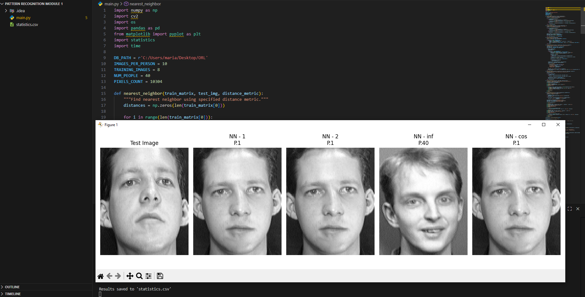
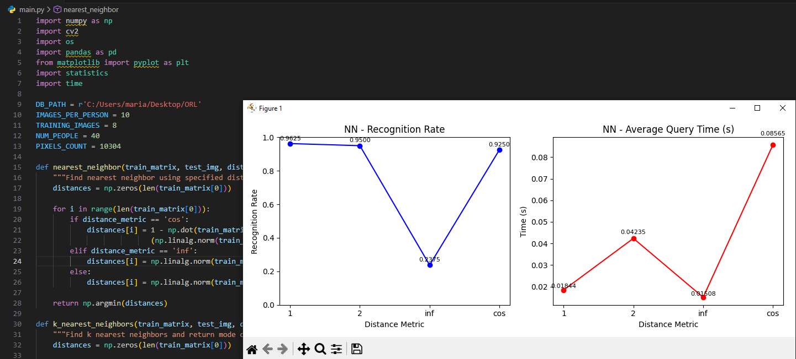
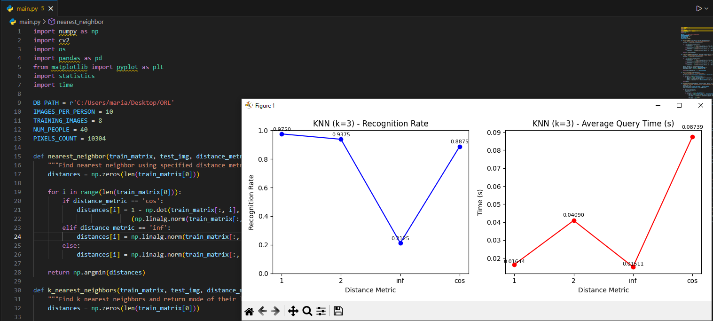

# Face Recognition using NN and KNN

A face recognition system implemented in Python that compares Nearest Neighbor (NN) and K-Nearest Neighbors (KNN) algorithms using various distance metrics on the ORL face database.

## 📋 Overview

This project implements and evaluates face recognition algorithms using:
- **Nearest Neighbor (NN)** classifier
- **K-Nearest Neighbors (KNN)** classifier with multiple k values
- Multiple distance metrics (L1, L2, L∞, Cosine)
- Performance analysis through recognition rates and query times

## 🎯 Features

- Face recognition using pixel-based comparison
- Support for multiple distance metrics:
  - L1 norm (Manhattan distance)
  - L2 norm (Euclidean distance)
  - L∞ norm (Chebyshev distance)
  - Cosine similarity
- K-NN implementation with k values: 3, 5, 7, 9, 11
- Performance visualization with graphs
- Detailed statistics export to CSV

## 📊 Dataset

The project uses the **ORL Face Database** which contains:
- 40 people (subjects)
- 10 images per person
- Image size: 92x112 pixels
- Format: PGM (grayscale)

**Training/Test Split:**
- Training: 8 images per person (320 total)
- Testing: 2 images per person (80 total)

## 🚀 Installation

### Prerequisites

```bash
pip install numpy opencv-python pandas matplotlib
```

### Required Libraries

- `numpy` - Numerical computations
- `opencv-python` (cv2) - Image processing
- `pandas` - Data manipulation and CSV export
- `matplotlib` - Visualization and plotting

## 💻 Usage

1. Set the database path in the code:
```python
DB_PATH = r'C:\path\to\ORL'
```

2. Run the script:
```bash
python face_recognition.py
```

3. The program will:
   - Train on 320 images (8 per person)
   - Test on 80 images (2 per person)
   - Generate performance statistics
   - Create visualization plots
   - Export results to `statistics.csv`

## 📈 Results

### 1. Face Recognition Demo

The system predicts which person a test image belongs to using different distance metrics:



### 2. Console Output

Real-time performance metrics for each algorithm and distance metric:


### 3. NN Performance

Recognition rate and average query time for Nearest Neighbor algorithm:



### 4. KNN Performance

Performance comparison across different k values (3, 5, 7, 9, 11):



## 🔧 How It Works

### Training Phase
1. Load 8 images per person (320 total images)
2. Convert each image to a column vector (10,304 pixels)
3. Build training matrix of size 10304 × 320

### Testing Phase
1. For each test image:
   - Calculate distance to all training images
   - Find nearest neighbor(s)
   - Predict person identity
2. Evaluate recognition rate and query time

### Distance Metrics

- **L1 (Manhattan)**: `||x - y||₁ = Σ|xᵢ - yᵢ|`
- **L2 (Euclidean)**: `||x - y||₂ = √(Σ(xᵢ - yᵢ)²)`
- **L∞ (Chebyshev)**: `||x - y||∞ = max|xᵢ - yᵢ|`
- **Cosine**: `1 - (x·y)/(||x|| ||y||)`

## 📁 Project Structure

```
Pattern-Recognition-Module-1/
│
├── main.py      # Main implementation
├── statistics.csv            # Generated results
├── README.md                 # This file
│
└── screenshots/
    ├── face_recognition.png  # Demo prediction
    ├── console_output.png    # Algorithm output
    ├── nn_graphs.png         # NN performance
    └── knn_graphs.png        # KNN performance
```

## 📊 Output Files

### statistics.csv
Contains detailed results with columns:
- `Algorithm` - NN or KNN
- `K` - k value (for KNN only)
- `Distance_Metric` - 1, 2, inf, or cos
- `Recognition_Rate` - Accuracy (0-1)
- `Avg_Query_Time` - Average time per query (seconds)

## 🎓 Key Functions

- `build_training_matrix()` - Constructs training data matrix
- `nearest_neighbor()` - NN classifier implementation
- `k_nearest_neighbors()` - KNN classifier with voting
- `evaluate_classifier()` - Performance evaluation
- `predict_demo_image()` - Single image prediction
- `visualize_predictions()` - Display prediction results
- `plot_performance_from_csv()` - Generate performance graphs

## 🔍 Performance Metrics

The system evaluates two key metrics:

1. **Recognition Rate (RR)**: Percentage of correctly identified faces
2. **Average Query Time (AQT)**: Mean time to classify one image

## 📝 Notes

- All images are flattened to 10,304-dimensional vectors
- KNN uses mode voting to determine final prediction
- Performance varies significantly across distance metrics
- Cosine similarity often performs well for face recognition
- Increasing k in KNN can improve stability but may reduce accuracy

**Database**: ORL Face Database  
**Language**: Python 3.12.  
**Focus**: Computer Vision, Pattern Recognition, Machine Learning
